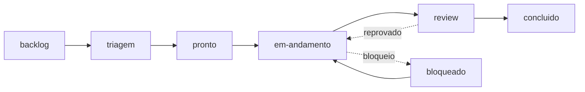

# Sistema de tickets — fluxo de trabalho por agentes

Toda atividade do projeto (feature, bug, débito, conteúdo, doc) vira um **ticket** nesta pasta. Tickets são a unidade de trabalho e o **veículo de contexto entre agentes**: cada agente que toca um ticket registra o que fez no diário de bordo do próprio arquivo, para que o próximo agente (de qualquer CLI) continue sem re-descobrir nada.

## Estrutura

```
.ai/tickets/
├── README.md        # este arquivo
├── TEMPLATE.md      # template de ticket
├── BOARD.md         # quadro: índice de tickets por status (sempre atualizado)
└── TCK-NNNN-<slug>.md
```

## Ciclo de vida



| Status | Significado | Quem move |
|---|---|---|
| `backlog` | Criado, ainda não triado | criador (`/ticket`) |
| `triagem` | Agente de triagem analisando | agente **triagem** |
| `pronto` | Triado: classificado, priorizado, com plano | agente **triagem** |
| `em-andamento` | Em execução (devloop) | agente **executor** |
| `review` | Implementado, aguardando revisão | agente **executor** |
| `concluido` | Revisado e validado | agente **revisor** |
| `bloqueado` | Depende de decisão do Douglas ou de outro ticket | qualquer agente |

## O pipeline de agentes

1. **Criação** (`/ticket <descrição>`): qualquer sessão/humano cria o ticket em `backlog` e atualiza o `BOARD.md`.
2. **Triagem** (`/triagem`, agente `triagem`): lê o ticket + contexto do projeto; classifica (tipo, prioridade, fase do plano); verifica duplicidade; decide se precisa de spec (`/spec`) ou ADR (`/adr`) antes do código; escreve o plano de execução no ticket; move para `pronto`. **Não implementa nada.**
3. **Execução** (`/trabalhar [TCK-NNNN]`, agente `executor`): pega o ticket `pronto` de maior prioridade (ou o indicado); move para `em-andamento`; segue o plano da triagem executando o devloop (`.ai/devloop.md`); registra cada descoberta no diário de bordo; ao terminar, valida (`yarn lint` + `yarn build`) e move para `review`. Se interrompido, cria handoff em `.ai/handoff/` **referenciando o ticket**.
4. **Revisão** (agente `revisor`): revisa o diff contra os critérios de aceite do ticket e as regras editoriais (`.ai/memory/posicionamento-marca.md`); aprova (→ `concluido`) ou devolve com apontamentos no diário (→ `em-andamento`).

Cada etapa pode ser feita por um subagente na mesma sessão, por outra sessão do Claude Code, ou por outra CLI (Codex/Copilot) — o contexto viaja pelo **arquivo do ticket**, nunca pela memória da conversa.

## Regras de contexto (o coração do sistema)

- **Todo agente, antes de agir:** lê o ticket inteiro (incluindo diário), `.ai/context.md` e as memórias relevantes.
- **Todo agente, depois de agir:** adiciona entrada no diário de bordo do ticket (data, agente, o que fez, o que descobriu, o que falta) e atualiza `status`/`atualizado` no frontmatter + a linha no `BOARD.md`.
- Aprendizado que transcende o ticket → `.ai/lessons/LESSONS.md` ou `.ai/memory/`.
- Interrupção no meio da execução → handoff em `.ai/handoff/` com link para o ticket (e link do handoff no frontmatter do ticket).
- Decisão que só o Douglas pode tomar → status `bloqueado` + pergunta explícita no diário.

## Convenções

- ID sequencial: `TCK-0001`, `TCK-0002`, ... (4 dígitos). Arquivo: `TCK-NNNN-<slug-kebab>.md`.
- Prioridade: `P0` (quebra produção/confiança) > `P1` (estrutural) > `P2` (qualidade) > `P3` (nice-to-have).
- Tipo: `feature` | `bug` | `debito` | `conteudo` | `doc` | `infra`.
- Um ticket = uma entrega revisável. Grande demais? A triagem divide em tickets filhos e transforma o original em épico (lista de filhos).
