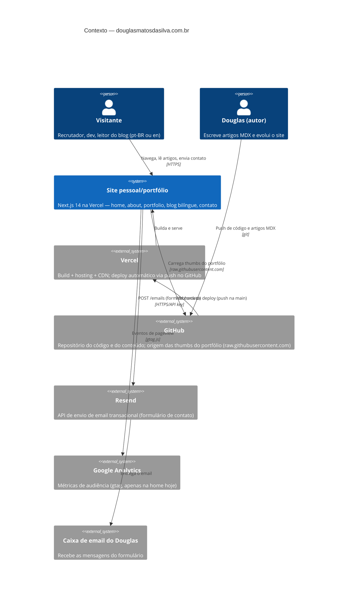

# C4 — Nível 1: Contexto do sistema

> Estado atual em 2026-08-16. O plano de reformulação (`../../plan/reformulation-plan.md`) altera partes deste diagrama — mudanças relevantes serão refletidas aqui quando implementadas.

## Visão

O sistema é um **site pessoal/portfólio com blog técnico bilíngue**, servido como aplicação Next.js na Vercel. Não há banco de dados nem backend próprio: todo o conteúdo é estático (MDX compilado em build) e a única integração de escrita é o envio de email do formulário de contato.

## Atores e sistemas externos

| Elemento | Papel | Observações |
|---|---|---|
| Visitante | Consome o site nas rotas `/br/*` ou `/en/*` | Idioma negociado por `Accept-Language` no primeiro acesso (middleware) |
| Douglas (autor) | Único mantenedor; publica via `git push` | Não existe CMS — o repositório é o CMS |
| Vercel | Build, hosting, CDN, env vars de produção | Integração via dashboard; **não há CI no repo** |
| Resend | Email transacional | Chave em env var; remetente ainda é `onboarding@resend.dev` (débito) |
| Google Analytics | Audiência | Script injetado apenas na home — cobertura parcial (débito) |
| GitHub | Código + conteúdo + imagens remotas do portfólio | Dependência de `raw.githubusercontent.com` em runtime para thumbs |

## Restrições de contexto

- Site **estático por design**: sem banco, sem auth, sem área logada.
- Conteúdo é código: publicar artigo = merge na `main`.
- Tudo bilíngue: qualquer conteúdo/rota existe em `br` e `en`.
