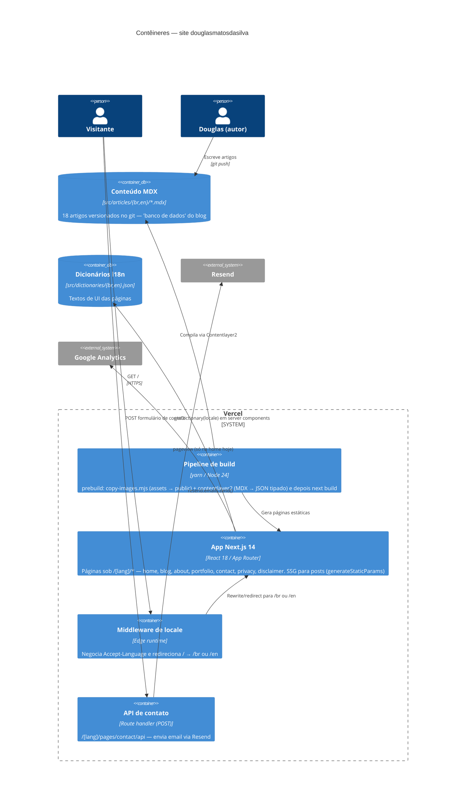

# C4 — Nível 2: Contêineres

> "Contêiner" no sentido C4 (unidade executável/implantável), não Docker.

O sistema é um único app Next.js, mas com três "contêineres" lógicos distinguíveis pelo momento de execução: **pipeline de build**, **app servido** (páginas SSG/SSR + middleware edge) e **rota de API**.

## Detalhe por contêiner

### Pipeline de build (`yarn build`)
1. `prebuild` → `copyimages`: `src/utils/copy-images.mjs` **esvazia** `public/images/` e copia tudo de `src/assets/images/`.
2. `prebuild` → `clb`: `rimraf .contentlayer && contentlayer2 build` — valida frontmatter contra o schema de `contentlayer.config.js` e gera `.contentlayer/generated` (importado via alias `contentlayer/generated`).
3. `next build` — inclui o typecheck TS (único gate de tipos do projeto).

### App Next.js
- **Todas as rotas sob `src/app/[lang]/`** (`lang ∈ {br, en}`); não existe `app/page.tsx` — a raiz depende do middleware.
- Posts pré-renderizados por `generateStaticParams` a partir de `allDocs`.
- ⚠️ Duas fontes de leitura de conteúdo coexistem: Contentlayer (`[slug]`, sitemap) e `fs`+`gray-matter` via `src/lib/blog.ts` (listagem do blog, LastPosts). Convergência é débito planejado (ver ADR-0002 e current-state).
- SEO programático: `sitemap.ts`, `robots.ts`, `manifest.ts` em `src/app/`.

### Middleware de locale (`src/middleware.ts`)
- `negotiator` + `@formatjs/intl-localematcher` sobre `Accept-Language`; fallback `br`.
- Matcher exclui `api`, `_next`, assets — mas só no início do path (a API aninhada de contato ainda passa pelo middleware; débito registrado).

### API de contato (`src/app/[lang]/pages/contact/api/route.ts`)
- POST com nome/email/mensagem → Resend → email do Douglas.
- Débitos: sem validação de input, envio não aguardado (`await` ausente), duplicada por idioma, remetente sandbox.
