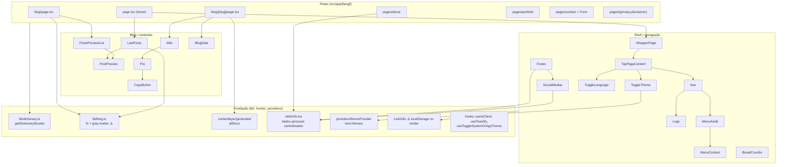

# C4 — Nível 3: Componentes

Zoom no contêiner **App Next.js**. Agrupamento lógico dos ~24 componentes + libs (o código fonte é flat em `src/components/`).

## Componentes por responsabilidade

### Shell / navegação
| Componente | Tipo | Responsabilidade |
|---|---|---|
| `WrapperPage` | server | Casca da home (TopPageContent + children + Footer) |
| `TopPageContent` | server | Header: Nav + toggles de tema/idioma (carregados com `dynamic` + `LoadIcon`) |
| `Nav`, `Logo`, `MenuAside`, `MenuContent` | misto | Menu principal; drawer mobile (client) |
| `BreadCrumbs` | client | Migalhas a partir de `usePathname`, com dicionário inline próprio ⚠️ |
| `Footer`, `SocialMedias` | server | Rodapé com links sociais de `info()` |

### Blog / conteúdo
| Componente | Tipo | Responsabilidade |
|---|---|---|
| `Mdx` | client | Renderiza MDX compilado (`useMDXComponent`); ⚠️ mapeia h2/h3 → `<h1>` e `b` → `<bdo>` (bugs registrados) |
| `Pre` + `CopyButton` | client | Bloco de código com botão copiar |
| `PostsPreviewList`, `PostPreview`, `LastPosts` | misto | Listagens; usam `lib/blog.ts` (caminho fs), não Contentlayer ⚠️ |
| `BlogDate` | server | Formatação de data (date-fns) |

### i18n
| Peça | Responsabilidade |
|---|---|
| `middleware.ts` | Negociação de locale e redirect da raiz |
| `lib/dictionary.ts` | Import dinâmico de `dictionaries/{br,en}.json` (server-only) |
| `LinkI18n` | Link com prefixo de locale — ⚠️ lê `localStorage` durante render (pode gerar `/null/...`) |
| `ToggleLanguage` | Troca de idioma + persistência em `localStorage['lang']` |

### Tema
`ToggleTheme` → `useToggleSystemOrAppTheme` → `themeProvider` (next-themes, `darkMode: 'class'` no Tailwind).

### Código morto conhecido (não construir em cima)
`src/utils/blog/*` (exceto `mountSlugParam.ts`), `lib/redirecti18nPathName.ts` (vazio), `utils/links.ts`, `utils/constants.ts`, `utils/ascii_utf8_binary.ts`. Detalhe em `../../current-state.md`.
