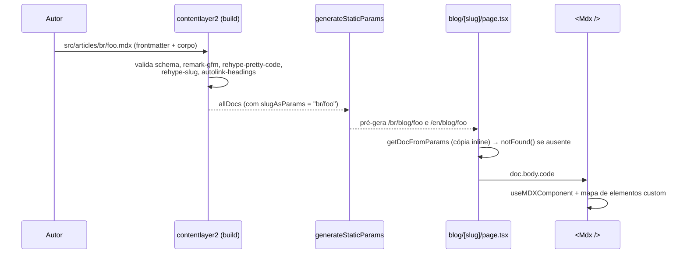
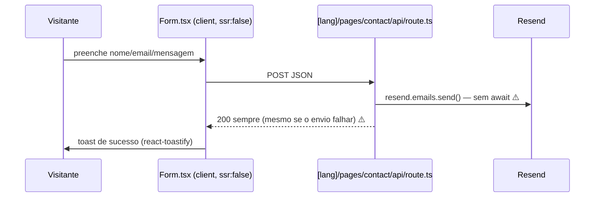

# C4 — Nível 4: Código

O nível 4 do C4 é intencionalmente enxuto: documentamos apenas os fluxos de código que não são óbvios lendo os arquivos. Para o resto, o código é a documentação.

## Fluxo 1 — Do MDX à página do post



Pontos de atenção no código:
- `slugAsParams` **já contém o idioma** (`br/foo`). A rota real é `/[lang]/blog/[slug]` — quem monta URL a partir de `slugAsParams` precisa reordenar (o `sitemap.ts` erra exatamente isso hoje).
- A função `getDocFromParams` viva é a **cópia inline** em `src/app/[lang]/blog/[slug]/page.tsx`; a de `src/utils/blog/` é órfã.

## Fluxo 2 — Resolução de idioma no primeiro acesso

```mermaid
sequenceDiagram
    participant B as Browser
    participant MW as middleware.ts (edge)
    participant App as app/[lang]

    B->>MW: GET / (Accept-Language: pt-BR,en;q=0.8)
    MW->>MW: negotiator + intl-localematcher<br/>sobre i18n.config.ts (['br','en'], default 'br')
    MW-->>B: 307 → /br
    B->>App: GET /br
    Note over B,App: Depois do primeiro clique em ToggleLanguage,<br/>o locale passa a viver em localStorage['lang']<br/>e LinkI18n prefixa os hrefs no client ⚠️
```

O ponto frágil: existem **duas fontes de verdade do locale** — o segmento de URL (server) e `localStorage` (client). Componentes que leem `localStorage` no render (`LinkI18n:16`, `MenuContent:11`, `ToggleLanguage:13`) dependem de `ssr: false` para não quebrar e geram `/null/...` se a chave não existir.

## Fluxo 3 — Formulário de contato



## Convenções de código observadas

- TS `strict`; 4 espaços; sem ponto-e-vírgula; componentes PascalCase, um por arquivo, flat em `src/components/`.
- Server components por padrão; `'use client'` apenas onde há interação. (Há uso excessivo de `dynamic(..., {ssr:false})` — débito.)
- Textos de página vêm sempre de `getDictionary(lang)`; interpolação de variáveis via `lib/handleText.ts`.
- Dados pessoais (nome, links, emails, datas) **somente** via `src/utils/info.tsx`.
