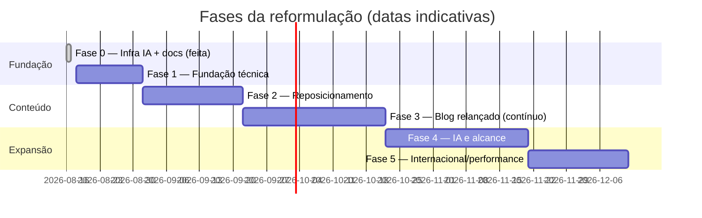

# Plano de reformulação — douglasmatosdasilva

> **Data:** 2026-08-16 · **Status:** proposto (aguardando aprovação do Douglas)
> Baseado na auditoria completa do repositório ([current-state.md](../current-state.md)) e na análise do banco de evidências profissional privado do Douglas (já **sanitizada** conforme as regras de `.ai/memory/posicionamento-marca.md` — este documento é público e não contém dados sensíveis).

## 1. Diagnóstico: o problema não é técnico, é de posicionamento

O site de hoje conta a história do Douglas de **2023**: um blog de desafios iniciantes de Java/JavaScript (HackerRank/Beecrowd) e um portfólio de apps de estudo (Todo App, Weather app). O Douglas de **2026** é outro profissional:

- **O que ele JÁ FEZ:** ~7,5 anos de carreira; liderou por 11 meses uma frente mobile construindo **PWA offline-first** para operações de campo com conectividade precária; centenas de entregas documentadas ao longo de 6+ anos, com trajetória mensurável de frontend-dominante (2020–22) para backend-dominante (2025–26) — a definição literal de fullstack.
- **O que ele FAZ:** desenvolvedor fullstack em uma **plataforma de agregação e análise de KPIs operacionais para o setor de energia** — telemetria industrial em tempo real (Java/Kotlin/Spring, mensageria com Apache Pulsar, PostgreSQL/MongoDB, React/TypeScript). Conduz features de ponta a ponta (refinamento com especialistas de domínio → ADR → API → implementação → testes → docs). Construiu a base de conhecimento **RAG + MCP** consultada por agentes de IA no fluxo real do time e automatizou release notes com IA no CI/CD.
- **O que ele VAI FAZER:** consolidar excelência técnica visível (observabilidade, frontes de autoria formal), ampliar alcance além do time (apresentações, RFC, mentoria), produzir conteúdo técnico público (a lacuna nº 1 hoje: zero artigos/palestras registrados fora deste blog parado) e preparar-se para o mercado internacional com presença bilíngue.

**Tese do plano:** transformar o site de "blog de exercícios + portfólio de estudos" em **a prova pública dos 3 diferenciais reais** do Douglas:

1. **Dados/telemetria industrial em tempo real** (nicho O&G — raro no mercado)
2. **Produção distribuída** (Java/Kotlin/Spring, mensageria, streams, SQL/NoSQL)
3. **IA aplicada à engenharia** (RAG, MCP, AI agents em produção — não buzzword)

## 2. Identidade e regras editoriais (invioláveis)

- Título público: **"Fullstack Developer @ INTELIE"** — nunca "Sênior", "III" ou numeração.
- Assinatura humana mantida: *"Father, husband, brother and software developer."*
- Trabalho descrito genericamente ("plataforma de agregação e análise de KPIs operacionais para o setor de energia"); **nunca** nomes internos (repos, tickets, clientes, colegas), salário ou dados pessoais sensíveis.
- Não reivindicar operação de cloud/K8s em produção; não declarar fluência em inglês falado.
- Tudo bilíngue: cada peça nasce em pt-BR **e** en.
- Permitido e desejado: volumes agregados (nº de entregas/testes/período), tipos de problema, tecnologias de mercado, cases narrados genericamente.

Checklist completo: `.ai/memory/posicionamento-marca.md`.

## 3. Público-alvo (em ordem de prioridade)

1. **Liderança/RH da empresa atual** — o site evidencia escopo, influência e produção técnica (apoia o objetivo de reconhecimento formal).
2. **Recrutadores/mercado BR** — fullstack Java/Spring + React com nicho raro; demanda comprovada pelo histórico de abordagens.
3. **Mercado internacional** — a versão en de qualidade é preparação deliberada para quando a conversação em inglês destravar.

## 4. As fases

### Fase 0 — Fundação de engenharia assistida por IA ✅ (entregue em 2026-08-16)

Infra multi-CLI (`AGENTS.md`/`CLAUDE.md`/copilot-instructions), contexto `.ai/` (memory, lessons, devloop, handoff), slash commands portáveis, documentação C4 + ADRs + specs retroativas, este plano.

### Fase 1 — Fundação técnica (estimativa: 1–2 semanas de sessões)

Objetivo: repositório confiável antes de qualquer feature. Sequência:

1. **Saneamento de dependências:** declarar as fantasma (ou eliminá-las na convergência do item 4), remover as não usadas (`react-router-dom`, `cookies-next`, `tailwind@4` homônimo, `shiki`/`shikiji`, etc.), decidir fontes (importar `@fontsource/ranga` de fato ou trocar a fonte display).
2. **Upgrade de plataforma:** Next 14 → 15 (App Router estável) + React 19 + Tailwind atualizado; avaliar contentlayer2 vs `velite`/MDX nativo — se trocar, novo ADR substituindo o 0002.
3. **Correções P0:** form de contato (await + validação com zod + escape + rota única `app/api/contact` + domínio verificado no Resend), sitemap (URLs com locale, todas as páginas), `Mdx.tsx` (h2/h3/b corretos, imagens com alt e dimensões do frontmatter), locale sem `localStorage` no render (fonte de verdade = URL).
4. **Convergência de conteúdo:** apagar `lib/blog.ts`/`mdToHtml.ts` e ler tudo de Contentlayer; migrar `tags` de CSV para lista; corrigir `chanllenges` → `challenges` nos 16 artigos.
5. **Migração `NEXT_PULIC_` → nomes corretos** (coordenada com a Vercel, num único deploy).
6. **Automação de qualidade:** GitHub Actions (lint + typecheck dedicado + build), Prettier + `.editorconfig`, `.nvmrc` + `packageManager`, testes mínimos (Vitest para libs; Playwright smoke: home, blog, post, troca de idioma, form) — replicando o padrão "CI como portão de mérito" que o Douglas já usa em projetos pessoais. Substitui o ADR-0007 por um novo.
7. **Higiene:** unificar layouts duplicados, apagar código morto, README real, limpar branches remotas, parar de versionar `public/images/`.

**Gate de saída:** CI verde obrigatória, Lighthouse ≥ 90 em performance/SEO/a11y nas páginas principais.

### Fase 2 — Reposicionamento do conteúdo institucional (2–3 semanas)

O coração da reformulação. Specs novas (spec-006+) antes de cada página:

1. **Home nova:** hero com o posicionamento ("Fullstack Developer — dados em tempo real para operações industriais · IA aplicada à engenharia"), os 3 diferenciais como seções escaneáveis, prova social (2 recomendações públicas do LinkedIn), últimos artigos e cases em destaque. Manter a assinatura humana.
2. **About reescrito:** narrativa de trajetória (freelance 2019 → frontend/PWA 2020–22 → fullstack com domínio de backend 2025+), formação (Engenharia de Software concluída trabalhando em tempo integral), valores (constância 2019→2026 no GitHub, "It's not possible. No, it's necessary."). Corrigir as datas dinâmicas quebradas de `info.tsx`.
3. **Portfólio → Case studies:** substituir os apps de estudo por **cases profissionais sanitizados** (formato: contexto → problema → ação → resultado → stack):
   - PWA offline-first para operações de campo (liderança de frente, 11 meses)
   - Suíte E2E Playwright criada do zero (10 specs, edge cases de timezone/meia-noite)
   - Base de conhecimento RAG + servidor MCP consultada por agentes de IA (em produção)
   - Diagnóstico e correção de OOM em pipeline de exportação em produção
   - Feature ponta a ponta: refinamento com especialista → ADR → API REST com autorização por papéis → engine de classificação em tempo real
   - Release notes automatizadas com IA no CI/CD
   - Projetos pessoais selecionados: `mathematics-studies` (PWA educacional bilíngue open source, com ADRs e CI) e 2–3 outros que sirvam à narrativa
4. **Página `/uses` ou `/stack`:** stack real com honestidade calibrada (produção vs estudo estruturado) — diferencial de credibilidade.
5. **Dados estruturados:** JSON-LD `Person` + `Article`; OG images dinâmicas por página (`next/og`).

### Fase 3 — Relançamento do blog (contínuo, iniciando ~1 mês após fase 2)

1. **Pilares editoriais** (alinhados aos diferenciais e ao plano de carreira):
   - *Dados em tempo real na prática* — streams, mensageria, modelagem de eventos, performance/memória
   - *IA aplicada à engenharia* — RAG, MCP, agentic workflows no fluxo real (o tema mais raro e com maior demanda)
   - *Qualidade de software* — E2E com Playwright, testes em sistemas orientados a eventos
   - Os artigos antigos de desafios permanecem (histórico honesto), reorganizados sob uma tag `fundamentos`.
2. **Primeiros 3 artigos** (já sugeridos no brief de posicionamento): construindo uma suíte E2E Playwright do zero; uma base de conhecimento RAG/MCP para times de engenharia; lições de PWA offline-first em campo.
3. **Features de blog:** filtro por tag, RSS/Atom, busca client-side leve, séries/coleções, tempo de leitura já existente mantido.
4. **Cadência realista:** 1 artigo/mês, sempre bilíngue — apoiado pelo comando `/new-article`.

### Fase 4 — Diferenciais de IA e alcance (após fase 3 estabilizar)

1. **Site "AI-friendly" como vitrine:** `llms.txt`, conteúdo estruturado para agentes — coerente com a marca "IA aplicada à engenharia".
2. **Demonstração pública de RAG:** busca semântica/Q&A sobre o próprio conteúdo do site (versão pública e sanitizada do padrão que ele domina) — a página em si vira um case.
3. **Automação editorial:** pipeline de revisão de artigos com agentes (gramática, consistência br/en, checklist de sanitização automatizado no CI).
4. **Distribuição:** newsletter opcional, cross-post (dev.to/LinkedIn), página de palestras/apresentações quando a frente de visibilidade multi-time gerar material público.

### Fase 5 — Internacional e performance contínua

Polimento da versão en (revisão nativa dos textos-chave), hreflang/canonical completos, monitoramento (analytics em todas as páginas — decidir GA4 vs alternativa leve tipo Plausible/Umami), Web Vitals no CI, acessibilidade auditada.

## 5. Sequenciamento e dependências

Regras de execução:
- Nenhuma feature de fase N começa com débito P0 da fase 1 aberto.
- Cada página/feature nova das fases 2–4 nasce de uma **spec** (`/spec`); cada mudança estrutural nasce de um **ADR** (`/adr`).
- Sessões de IA seguem o protocolo `.ai/` (contexto → devloop → handoff/lessons).

## 6. Critérios de sucesso

| Dimensão | Métrica | Alvo |
|---|---|---|
| Fundação | CI verde obrigatória; Lighthouse perf/SEO/a11y | ≥ 90 nas páginas principais |
| Posicionamento | Home/About/Cases refletem os 3 diferenciais, sem violar regras editoriais | revisão manual (checklist de sanitização) |
| Conteúdo | Artigos novos publicados (bilíngues) | 1/mês a partir da fase 3 |
| Alcance | Analytics em 100% das páginas; sitemap/hreflang corretos no Search Console | sem erros de indexação |
| Carreira | O site é utilizável como evidência em conversas de reconhecimento formal e com recrutadores | subjetivo, avaliado pelo Douglas |

## 7. Riscos

- **Escopo de conteúdo > escopo de código:** escrever cases e artigos bilíngues é o gargalo real. Mitigação: comandos de IA (`/new-article`), cadência modesta, cases curtos no formato fixo.
- **Sanitização:** um deslize expõe informação interna. Mitigação: checklist bloqueante em `.ai/memory/posicionamento-marca.md` aplicado em toda peça; fase 4 automatiza a checagem no CI.
- **Upgrade Next/Contentlayer2:** fork comunitário pode travar o upgrade. Mitigação: avaliar `velite`/MDX nativo no início da fase 1 e decidir por ADR.
- **Abandono pós-lançamento** (o site ficou 2 anos parado): a infraestrutura da fase 0 existe exatamente para baixar o custo de cada retomada — qualquer sessão de 30 min com `/contexto` + `/retomar` avança o plano.
